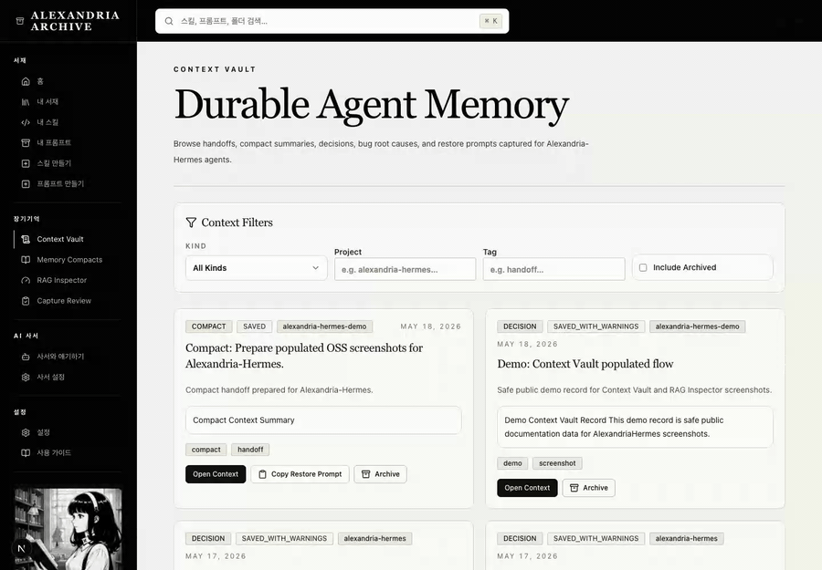
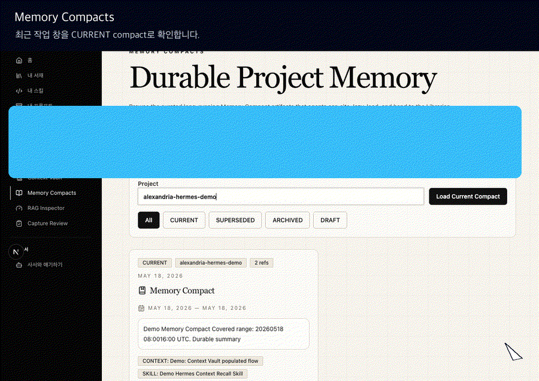
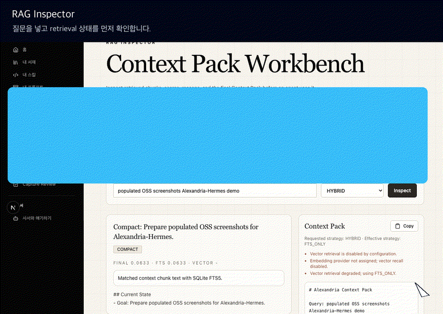
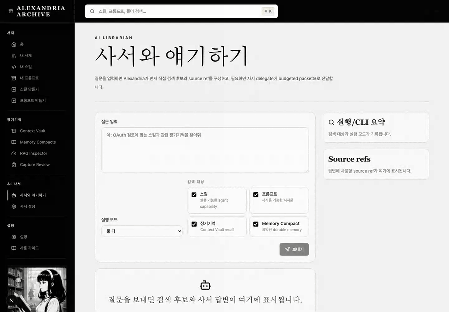

# ALEXANDRIA-HERMES

> Local-first agent library and recall layer for reusable skills, prompts, context, memory compacts, and optional librarian curation.

<p align="center">
  
</p>

<p align="center">
  <a href="https://www.python.org/downloads/"></a>
  <a href="https://docs.astral.sh/uv/"></a>
  <a href="https://fastapi.tiangolo.com/"></a>
  <a href="https://docs.pydantic.dev/"></a>
  <a href="https://www.sqlalchemy.org/"></a>
  <a href="https://modelcontextprotocol.io/"></a>
  <a href="https://typer.tiangolo.com/"></a>
  <a href="https://nextjs.org/"></a>
  <a href="https://react.dev/"></a>
  <a href="https://github.com/limhaneul12/alexandria-hermes/actions/workflows/backend.yml"></a>
  <a href="https://github.com/limhaneul12/alexandria-hermes/actions/workflows/frontend.yml"></a>
  <a href="./LICENSE"></a>
  
  
  
</p>

---

## What is Alexandria-Hermes?

Alexandria-Hermes is a **no-login, single-operator, local-first** archive for reusable AI-agent material.

It manages skills, prompts, captured context, memory compacts, librarian briefs, and retrieval metadata so humans and agents can register, classify, search, recall, and reuse work later. It is **not** an autonomous agent runtime, MCP marketplace, prompt marketplace, or generic hosted memory API; it is an agent-native operating library that Hermes-compatible agents can consult when local/current context is not enough.

Hermes is one client of the archive, not the archive itself:

- humans use the web UI or CLI to browse, create, import, and review records
- agents use HTTP, CLI, or MCP to search library/context material and submit reusable candidates
- optional librarian providers can classify, summarize, and delegate when explicitly configured
- Context Vault preserves handoffs, decisions, compact summaries, chunks, and access history for later recall

Current implementation focus:

- skill, prompt, and folder/category library management
- thin candidate search across title, summaries, tags, details, and content
- Context Vault linting, save/read, chunking, recall, access tracking, archive, and RAG health checks
- durable Memory Compact storage, current/history lookup, CLI/MCP exposure, and UI pages
- librarian brief compilation, librarian chat bridge, provider settings, and OpenAI/Codex provider flows
- Typer CLI and MCP server access for agent/tool clients
- typed FastAPI/Pydantic contracts backed by SQLite, SQLAlchemy Core/ORM, and Alembic
- Next.js document-style UI for dashboard, library, context, memory compacts, librarian chat, and settings

Current documentation entry points:

- [`install.md`](./install.md) — install entry point and runtime-mode chooser
- [`docs/install_guides/ko/install.md`](./docs/install_guides/ko/install.md) — Korean operator install guide
- [`docs/install_guides/en/install.md`](./docs/install_guides/en/install.md) — English operator install guide
- [`docs/install_guides/zh/install.md`](./docs/install_guides/zh/install.md) — 简体中文 operator install guide
- [`docs/install_guides/ja/install.md`](./docs/install_guides/ja/install.md) — 日本語 operator install guide
- [`docs/usage_guidebook/`](./docs/usage_guidebook/) — task-oriented feature/operator guides
- [`SECURITY.md`](./SECURITY.md) — local-first security model, secrets, and network exposure warnings
- [`CONTRIBUTING.md`](./CONTRIBUTING.md) — local development, quality gates, docs rules, and PR expectations
- [`ROADMAP.md`](./ROADMAP.md) — OSS readiness status and near-term roadmap

### Runtime paths

Alexandria-Hermes supports both human-facing UI use and agent-only library use. Choose the smallest runtime that matches the job:

| Runtime | Best for | Start here |
| --- | --- | --- |
| Backend + SQLite daemon | Hermes/MCP users who only need the backend library and database | `alexandria-hermes setup --mode backend-daemon --apply` |
| Full-stack separate processes | Local development with backend and frontend terminals | `alexandria-hermes setup --mode fullstack-separate --apply` |
| Full-stack Docker Compose | First-class full UI runtime in containers | `alexandria-hermes setup --mode fullstack-compose --apply` |
| Guidebook only | Planning install steps without writing local files | `alexandria-hermes setup --mode guidebook-only` |

If an agent is installing this for you, it should ask which runtime mode you want before applying changes. Installing Alexandria-Hermes alone does not make Hermes use it automatically; Hermes needs the MCP config and the `skills_alexandria` skill/prompt bundle installed or loaded.

### Product demo media

These demo assets use safe local demo records to show populated Context Vault, Memory Compact, RAG Inspector, and Librarian Chat flows.

| Context Vault flow | Memory Compacts flow |
| --- | --- |
|  |  |

| RAG Inspector flow | Librarian Chat flow |
| --- | --- |
|  |  |

To refresh real browser recordings for these flows, run the backend/frontend with safe demo data, install the pinned Playwright browser once, then record from the frontend package:

```bash
cd frontend
npm run demo:install-browsers
ALEXANDRIA_DEMO_FRONTEND_URL=http://127.0.0.1:3000 npm run demo:record
```

The recorder writes `.webm` captures to `docs/assets/demo/recordings/`. Publish selected recordings or convert them to optimized GIFs only after confirming they contain no operator keys, provider secrets, OAuth tokens, or private user data.

---

## Current Status

This repository is an active MVP. It is intended for localhost or otherwise access-controlled single-operator use by default.

Working surfaces include:

- FastAPI backend modules for archive, connections/providers, librarian, library, memory, retrieval, MCP, and platform runtime
- SQLite-backed local storage with Alembic migrations under `backend/migrations/`
- Next.js frontend pages for dashboard, library browsing/creation/detail, Context Vault, Memory Compacts, librarian chat, settings, providers, capture review, and RAG inspection
- native Typer CLI command tree:
  - `health`, `folders`, `library`, `skills`, `prompts`, `context`, `memory-compacts`, `hermes`, `librarian`, `usage`, `mcp`
- MCP server tooling over the same backend contracts
- SQL injection hardening on search paths through ORM/Core statements, bound parameters, and constrained FTS query normalization
- backend architecture guardrails for module boundaries, route mappings, app `__init__.py` usage, and rule compliance

Known boundaries:

- No user-account login/session system is implemented. Sensitive control-plane routes use one operator key.
- Public or team deployment needs an external access boundary first: VPN, reverse proxy auth, firewall allowlist, SSH tunnel, or equivalent.
- Live provider/OAuth delegation requires configured credentials and is not exercised by the default offline test suite.
- For explicitly approved frontend dependency changes, use committed lockfile updates and safe installs such as `npm install --ignore-scripts --no-audit --no-fund`; do not run arbitrary `npx` commands.

---

## Quick Start

### Backend

Create a repo-root `.env` with the local operator key if it does not already exist:

```bash
SERVICE_OPERATOR_API_KEY=replace-with-32-plus-character-local-operator-key
```

The backend reads this through `AppConfig`; sensitive provider/settings/librarian routes compare requests against it.

```bash
cd backend
uv sync
uv run alembic upgrade head
uv run uvicorn app.main:app --reload --host 127.0.0.1 --port 8000
```

Default local database:

- `backend/data/alexandria_hermes.db`

Health checks:

- Live: `http://localhost:8000/health/live`
- Ready: `http://localhost:8000/health/ready`

### Frontend

Use the committed lockfile/dependencies. For dependency changes, keep scripts disabled during install and run the supply-chain guard before other frontend tasks.

```bash
cd frontend
npm run security:npm-supply-chain
ALEXANDRIA_OPERATOR_API_KEY="replace-with-same-local-operator-key" npm run dev
```

Frontend runs at:

- `http://localhost:3000`

`npm run dev` and `npm run start` bind the Next.js server to `127.0.0.1` for local single-operator safety. Container runs use `npm run dev:container`/`npm run start:container` so the service binds only inside Docker while Compose publishes host ports on `127.0.0.1`.

### First recall loop

A good first-run success state is not just "the servers booted". Capture one durable context, recall it, then open it in the UI.

```bash
cat > /tmp/alexandria-first-context.md <<'MD'
# First Alexandria context

This local Alexandria-Hermes instance is running.
Use Context Vault for durable decisions, handoffs, plans, memory compacts, and reusable agent context.
MD

./bin/alexandria-hermes context save \
  --title "First Alexandria context" \
  --kind DECISION \
  --project alexandria-hermes \
  --content-file /tmp/alexandria-first-context.md

./bin/alexandria-hermes context recall \
  "durable decisions handoffs memory compacts" \
  --strategy FTS_ONLY \
  --project alexandria-hermes \
  --limit 3
```

Expected result: the recall response includes a Context Pack referencing the saved context. In the UI, check `/contexts` for the saved entry and `/rag-inspector` for retrieval health.

### Full Stack

Use the same repo-root `.env`, then run:

```bash
docker compose up --build
```

This starts:

- backend: `http://localhost:8000`
- frontend: `http://localhost:3000`

Compose runs backend/frontend containers on `0.0.0.0` inside the Docker network, but host port publishing is restricted to `127.0.0.1` in `docker-compose.yml`.

During the active npm supply-chain hold, avoid rebuilding the frontend image unless the hold is explicitly lifted because the frontend Dockerfile runs `npm ci`. If images already exist, use `docker compose up --no-build` for local smoke QA.

---

## CLI

The CLI is a Typer command tree over the backend HTTP API. It does not bypass backend permissions, validation, duplicate handling, Context Vault rules, or provider safety checks.

Install shell links once:

```bash
cd backend
uv sync
cd ..
./scripts/install-cli.sh
```

For control-plane commands, export the same operator key used by the backend:

```bash
export HERMES_API_URL=http://localhost:8000
export ALEXANDRIA_OPERATOR_API_KEY="replace-with-same-local-operator-key"
```

Examples:

```bash
alexandria-hermes health
alexandria-hermes folders list --tree
alexandria-hermes library list --type SKILL --folder-id <folder-id>
alexandria-hermes library search "dependency injection"
alexandria-hermes --json skills get <skill-id>
alexandria-hermes prompts list --limit 20
alexandria-hermes context lint ./handoff.md --kind HANDOFF --title "Sprint handoff"
alexandria-hermes context save --content-file ./handoff.md --kind HANDOFF --title "Sprint handoff"
alexandria-hermes context recall "dependency injection" --strategy HYBRID
alexandria-hermes context doctor-rag
alexandria-hermes --json memory-compacts current
alexandria-hermes memory-compacts list --limit 10
alexandria-hermes --json librarian ask "Find reusable FastAPI dependency-injection context"
alexandria-hermes mcp serve
```

Short alias:

```bash
alex-hermes health
```

Repo-local execution without installing shell links:

```bash
./bin/alexandria-hermes health
```

Hermes onboarding/apply flow:

```bash
alexandria-hermes --json hermes onboard \
  --hermes-home ~/.hermes \
  --api-url http://localhost:8000 \
  --operator-api-key "$ALEXANDRIA_OPERATOR_API_KEY" \
  --install-prompts \
  --install-mcp \
  --dry-run

alexandria-hermes --json hermes onboard \
  --hermes-home ~/.hermes \
  --api-url http://localhost:8000 \
  --operator-api-key "$ALEXANDRIA_OPERATOR_API_KEY" \
  --install-prompts \
  --install-mcp
```

This installs Alexandria-Hermes Hermes guidance, policy files, and an MCP config snippet under the Hermes home. Full installation details are in [`install.md`](./install.md).

---

## Context, Memory Compacts, and RAG

Context Vault stores agent working context as first-class library material.

Supported behaviors:

- lint context Markdown before saving
- redact and score context quality signals
- save handoffs, notes, decisions, compact summaries, and project context
- chunk saved context for retrieval
- recall a Context Pack by query and strategy
- track access events for context use
- prepare and browse durable Memory Compact artifacts
- inspect RAG dependency health
- archive entries without hard deletion

Primary surfaces:

- backend routes under `/memory/contexts` and `/memory/compacts` plus frontend proxy routes under `/api/library/contexts` and `/api/library/compacts`
- frontend pages `/contexts`, `/contexts/{contextId}`, `/memory-compacts`, `/memory-compacts/{compactId}`, `/rag-inspector`
- CLI commands under `alexandria-hermes context ...` and `alexandria-hermes memory-compacts ...`
- MCP server via `alexandria-hermes mcp serve`

---

## OpenAI, Codex OAuth, and MCP

### OpenAI / Codex providers

Alexandria-Hermes separates official OpenAI API-key usage from ChatGPT/Codex-style OAuth.

Supported provider paths:

- `OPENAI` provider with an official OpenAI API key
- `OPENAI_CODEX` provider with ChatGPT/Codex OAuth device authorization

Provider secrets are stored only in backend provider-secret storage. Browser state and public config examples do not contain access tokens or refresh tokens. Live provider calls require configured credentials and an operator key.

### MCP

The MCP server exposes Alexandria-Hermes to MCP-capable agents and tool clients. It is an agent-facing access path over the same backend contracts, not a separate business-logic implementation.

---

## Development Commands

### Backend

```bash
cd backend
uv sync
uv run ruff format --check .
uv run ruff check .
uv run pyrefly check
uv run pytest -q
make ci
```

### Frontend

```bash
cd frontend
npm run security:npm-supply-chain
npm run lint
npm run test:ui-contract
npm run test:librarian-chat
npm run test:library-ui-navigation
npm run test:content-viewer
npm run test:library-category-filter
npm run test:ask-librarian-widget
npm run test:agent-route-payload
npm run build
npm run dev
```

---

## Product Philosophy

> Knowledge should not only be stored.  
> It should remain findable, reusable, attributable, and usable by agents at the right moment.

Alexandria-Hermes aims to become an operational archive where:

- skills are reusable capabilities
- prompts are reusable instruction artifacts
- folders behave like shelves
- context entries preserve what agents learned and decided
- memory compacts preserve durable summaries of larger workstreams
- usage history and RAG recall improve retrieval
- librarian agents are optional helpers, not hard dependencies
- humans and agents can both participate

---

## OSS Readiness

Before a broad public OSS launch, keep this checklist visible:

- [x] README explains the agent-native library/reuse model instead of positioning Alexandria-Hermes as a generic RAG app.
- [x] Local quickstart reaches a visible recall result: capture → recall → inspect.
- [x] Task-oriented usage guides cover install, MCP runtime, policy, self-acquisition, librarian collaboration, context recall, library assets, security, and troubleshooting.
- [x] Backend quality gates pass locally: format, lint, type check, guardrails, and full tests.
- [x] Frontend lint/contracts/build pass after clearing generated `.next` artifacts when needed.
- [x] `SECURITY.md`, `CONTRIBUTING.md`, and `ROADMAP.md` are present.
- [x] MIT `LICENSE` is present at the repository root.
- [x] Backend and frontend GitHub Actions workflow badges are configured.
- [x] GitHub bug/feature issue templates and PR template are present.
- [x] Short demo GIFs are present for the main populated flows.

The remaining public-launch gaps are operational docs and examples: backup/restore, Docker Compose upgrade guidance, API/MCP examples, and any final security disclosure polish.
